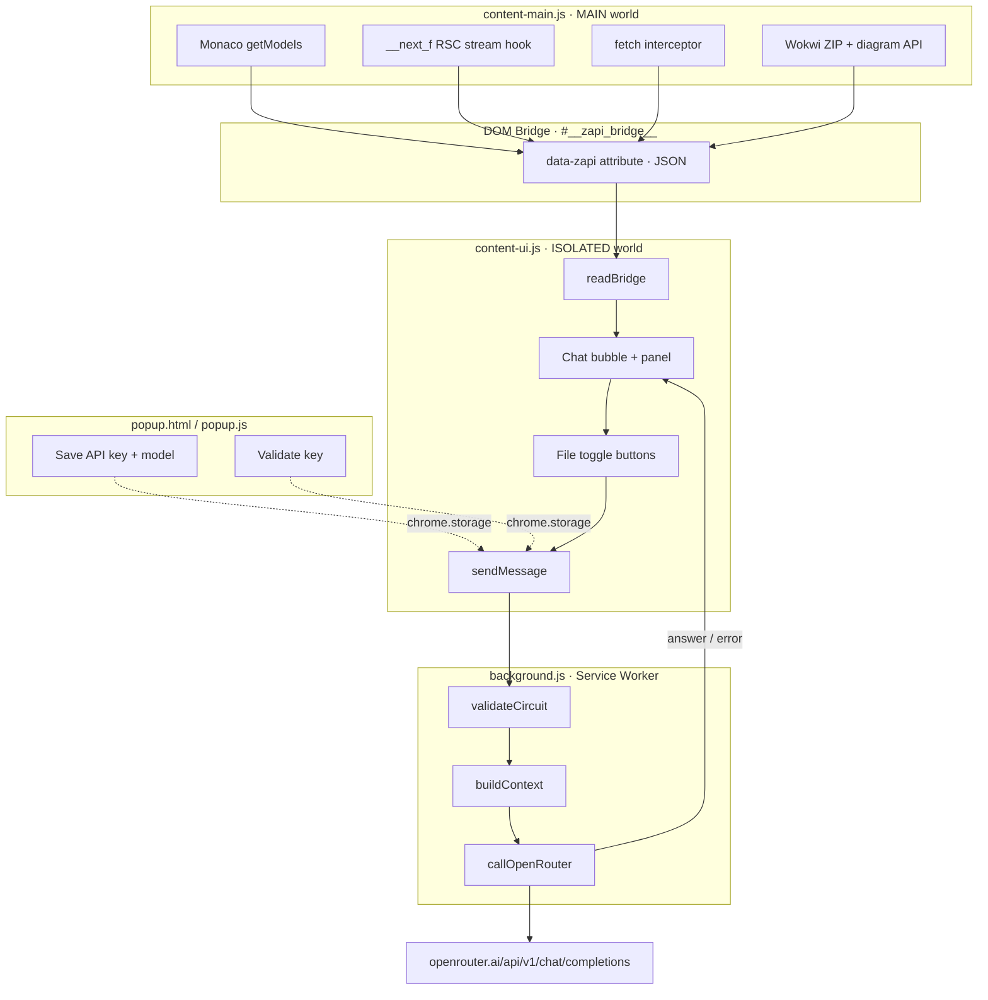

# ZAPI — AI Electronics Tutor for Wokwi

> Ask questions about your circuit in Hebrew or English — directly inside [Wokwi](https://wokwi.com).
> No server. No setup. No code pasting.

---

## What is ZAPI?

ZAPI is a Chrome extension that sits inside the Wokwi online electronics simulator.
It reads your live circuit (code files + `diagram.json`) automatically, validates connections, and answers your questions using any AI model via [OpenRouter](https://openrouter.ai).

**Example questions you can ask:**
- "למה ה-LED שלי לא נדלק?"
- "Which resistor value should I use for pin 13?"
- "הסבר לי את הקוד שרשמתי"
- "Is my I2C wiring correct?"

---

## How it works



---

## Requirements

- **Chrome 103+** (Manifest V3)
- An **[OpenRouter](https://openrouter.ai) API key** (free tier available)
- No Python, no server, no Docker

---

## Installation — Step by Step

### Step 1 — Get an OpenRouter API key

1. Go to [openrouter.ai](https://openrouter.ai) and create a free account
2. Navigate to **Keys** → click **Create Key**
3. Copy the key (starts with `sk-or-...`) — you'll need it in Step 3

> The free tier gives you enough credits to test all models.
> Your key is stored only in your browser — never sent anywhere except OpenRouter.

---

### Step 2 — Load the extension in Chrome

1. Download or clone this repository:
   ```bash
   git clone https://github.com/AmitNahum/ZAPI.git
   ```
   Or download as ZIP → Extract it.

2. Open Chrome and navigate to:
   ```
   chrome://extensions/
   ```

3. Enable **Developer mode** using the toggle in the top-right corner

4. Click **Load unpacked**

5. Select the `extension/` folder inside the project
   *(not the root folder — the `extension/` subfolder)*

6. The ZAPI extension will appear in your extensions list with a ⚡ icon

---

### Step 3 — Configure your API key

1. Click the **⚡ ZAPI icon** in the Chrome toolbar
   *(if the icon is hidden, click the puzzle piece icon → pin ZAPI)*

2. Paste your OpenRouter API key into the field

3. Select your preferred AI model from the dropdown

4. Click **שמור והפעל** (Save & Activate)

   A green checkmark confirms the key is valid.

---

### Step 4 — Use ZAPI on Wokwi

1. Open any project at [wokwi.com](https://wokwi.com)
2. A **⚡ bubble** appears in the bottom-right corner of the page
3. Click the bubble to open the chat panel
4. Ask any question about your circuit — in Hebrew or English

**Tips:**
- The file toggle buttons (top of the panel) let you include or exclude specific files from the AI context
- Drag the bubble anywhere on the screen
- Drag the top edge of the panel to resize it
- Long-press the send button (1.5s) to see a debug summary of extracted files

---

## Supported AI Models

ZAPI works with any model available on OpenRouter. The following are pre-configured in the dropdown:

| Model | OpenRouter ID | Best for |
|-------|--------------|----------|
| Claude Sonnet 4.5 | `anthropic/claude-sonnet-4-5` | Best quality, Hebrew + code |
| Claude Opus 4.5 | `anthropic/claude-opus-4-5` | Most capable, complex circuits |
| GPT-4o | `openai/gpt-4o` | Fast, high quality |
| GPT-4o mini | `openai/gpt-4o-mini` | Fast + cheap |
| Gemini 1.5 Pro | `google/gemini-1.5-pro` | Large context window |
| Gemini 2.0 Flash | `google/gemini-2.0-flash` | Very fast responses |
| Llama 3.3 70B | `meta-llama/llama-3.3-70b-instruct` | Open source, free tier |
| Mistral Large | `mistralai/mistral-large` | European alternative |

> **Recommended for beginners:** `google/gemini-2.0-flash` — fast and cheap.
> **Recommended for best Hebrew:** `anthropic/claude-sonnet-4-5`

### Using a custom model

OpenRouter supports hundreds of models. To use any model not in the list:
1. Find the model ID at [openrouter.ai/models](https://openrouter.ai/models)
2. Currently, custom model IDs require editing `popup.js` — add the ID to the `MODELS` array

---

## Circuit Validation

Every question triggers automatic static analysis before calling the AI.
Findings are injected into the AI context so it can reference them directly.

| Check | Severity |
|-------|----------|
| Pin used in code but missing wire in diagram | Error |
| LED cathode not connected | Error |
| LED missing current-limiting resistor | Error |
| LED cathode not reaching GND | Warning |
| `delay()` >= 5000 ms detected | Info |

---

## How circuit data is extracted

Wokwi uses **Monaco Editor** and **Next.js App Router** (RSC streaming).
`content-main.js` runs at `document_start` in the **MAIN world** and extracts files from multiple sources:

| Source | What it captures |
|--------|-----------------|
| `window.monaco.editor.getModels()` | All open files with exact filenames (primary) |
| `__next_f` RSC stream hook | Files streamed before editor renders |
| `fetch` interceptor | Lazy-loaded RSC chunks after page load |
| Wokwi ZIP API | All project files for public projects |
| Wokwi diagram API | `diagram.json` for public projects |

Files are written to a hidden DOM bridge element (`#__zapi_bridge__`).
`content-ui.js` runs in the **ISOLATED world** and reads from the bridge.

```
MAIN world              │  DOM (shared)             │  ISOLATED world
────────────────────────┼───────────────────────────┼────────────────────
content-main.js         │  #__zapi_bridge__          │  content-ui.js
Monaco + RSC + API ──►  │  data-zapi="{ files: {} }" │  ◄── readBridge()
```

---

## File Structure

```
ZAPI/
├── README.md
├── .gitignore
├── scripts/
│   └── zapi_deep_analyzer.py   # Architecture + security scan tool
└── extension/
    ├── manifest.json           # MV3 extension manifest
    ├── content-main.js         # MAIN world: multi-source data extraction
    ├── content-ui.js           # ISOLATED world: chat bubble UI + file toggles
    ├── background.js           # Service worker: validation + OpenRouter calls
    ├── popup.html              # Settings popup
    ├── popup.js                # Settings logic + key validation
    ├── styles.css              # Chat panel styles
    └── icon*.png               # Extension icons
```

---

## Development

```bash
# After editing any JS file:
# chrome://extensions/ → click the refresh icon on ZAPI

# Run architecture scan:
python -X utf8 scripts/zapi_deep_analyzer.py
```

The analyzer checks:
- All cross-script message links (broken link detection)
- API key privacy (never logged, only sent to OpenRouter)
- Safety guards (recursion depth, ZIP size, fetch timeouts)
- Manifest permissions (minimal attack surface)
- Storage key consistency

---

## Packaging for Chrome Web Store

Create a ZIP of the `extension/` folder only:

```bash
# Windows (PowerShell)
Compress-Archive -Path extension\* -DestinationPath zapi-extension.zip

# macOS / Linux
zip -r zapi-extension.zip extension/
```

Upload `zapi-extension.zip` in the [Chrome Web Store Developer Dashboard](https://chrome.google.com/webstore/devconsole).

> For local testing, skip the ZIP — just use **Load unpacked** and point to the `extension/` folder directly.

---

## Privacy & Security

- Your API key is stored only in `chrome.storage.local` on your own machine
- The key is sent **only** to `openrouter.ai` in an Authorization header
- No telemetry, no analytics, no third-party tracking
- Circuit code is sent to the AI model you choose — it never leaves OpenRouter's infrastructure
- The extension requests only the `storage` permission

---

## License

MIT
